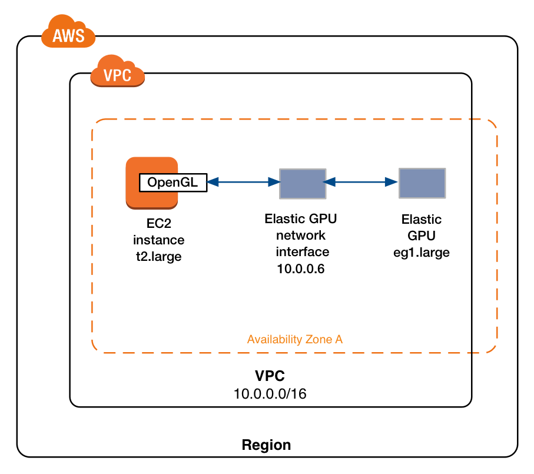
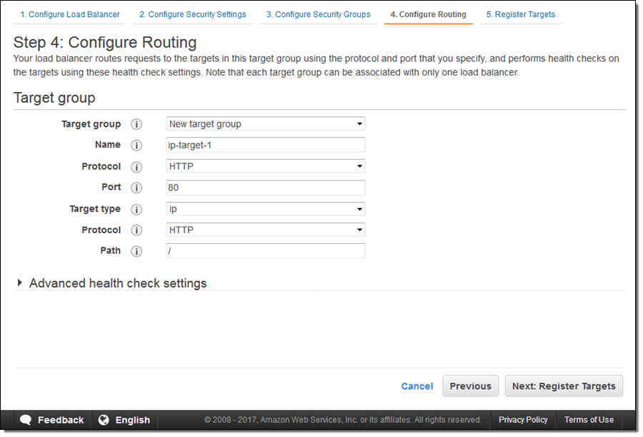
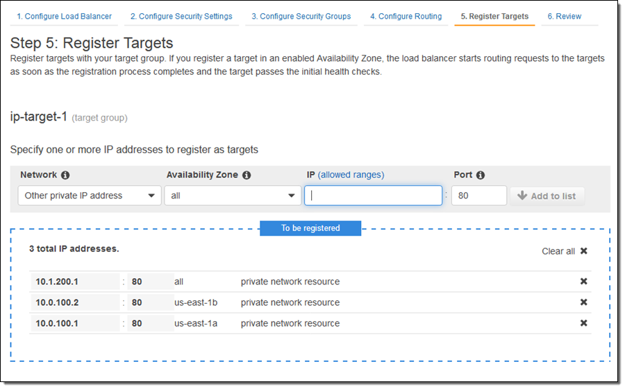

# [按秒计费 2017/09/21](https://aws.amazon.com/cn/blogs/china/new-per-second-billing-for-ec2-instances-and-ebs-volumes/)

总结：特定类型的EC2和EBS支持按秒计费，使用EC2/EBS的服务也能够获得按秒计费能力。

- EC2：以按需、预留和竞价形式发布的 Linux 实例的使用将按 1 秒的增量计费
- EBS：EBS 卷的预置存储也将按 1 秒的增量计费（可以理解为容量变化后即时改变计费？）
- Amazon EMR：借助适用于群集中的 EC2 实例的每秒计费功能。
- AWS Batch：AWS Batch 已启动和终止竞价型实例；利用每秒计费功能，批处理将变得更划算。

# [支持Windows的Elastic GPU 2017/09/13](https://aws.amazon.com/cn/blogs/china/new-ec2-elastic-gpus-for-windows/)

适用于 Windows 的 Amazon EC2 Elastic GPU 正式推出。
Elastic GPU 是一种 GPU 资源，可以挂载到 Amazon Elastic Compute Cloud (EC2) 实例来提升应用程序的图形性能。
Elastic GPU 提供 medium (1GB)、large (2GB)、xlarge (4GB) 和 2xlarge (8GB) 几种大小，可以作为 G3 或 G2 等 GPU 实例类型 (用于 OpenGL 3.3 应用程序) 的成本更低的替代方案。
您可以将 Elastic GPU 用于多种实例类型，灵活地为应用程序选择适当的计算、内存和存储资源，使之达到平衡。
您现在就可以在 us-east-1 和 us-east-2 区域预配置 Elastic GPU。
新服务将使运行特定图形工作负载的成本降低 80% 以上。

# [通过 IP 地址在 AWS 和本地资源间实现应用程序负载均衡](https://aws.amazon.com/cn/blogs/china/new-application-load-balancing-via-ip-address-to-aws-on-premises-resources/)

负载均衡允许针对每一个URL定制后端的IP组

1. 定义路由信息，针对URL定义后端IP组

2. 定义IP组中的IP

# [AWS SAM Local (Beta 版) – 在本地构建和测试无服务器应用程序 2017/08/21](https://aws.amazon.com/cn/blogs/china/new-aws-sam-local-beta-build-and-test-serverless-applications-locally/)

SAM Local是一款本地安装的开发工具，用于支持Serverless应用程序的开发、调试、部署。

# [AWS 纽约峰会 – 公告汇总](https://aws.amazon.com/cn/blogs/china/aws-new-york-summit-announcement-summary/)

# [AWS 合作伙伴系列网络研讨会 – 2017 年 8 月](https://aws.amazon.com/cn/blogs/china/aws-partner-series-webinar-august-2017/)

# [AWS技术峰会纽约站](https://aws.amazon.com/cn/blogs/china/aws-technology-summit-new-york-station/)

发布了7个新的服务

多个客户宣布要和AWS合作，把业务迁移到AWS

# [在 AWS Twitch 频道上推出 GameDay Essentials 节目](https://aws.amazon.com/cn/blogs/china/game-day-essentials-show-on-twitch/)

发布了一些AWS培训类的视频

# TestTest