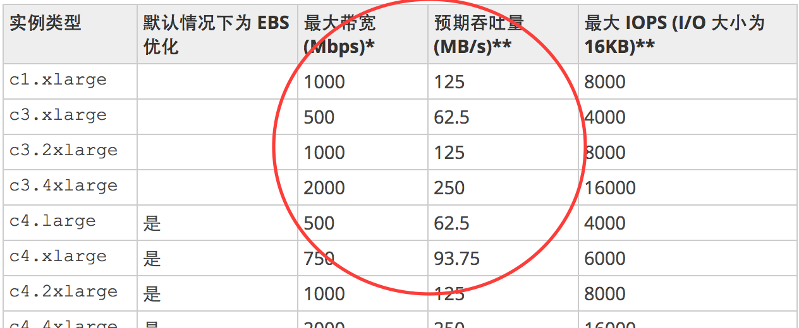
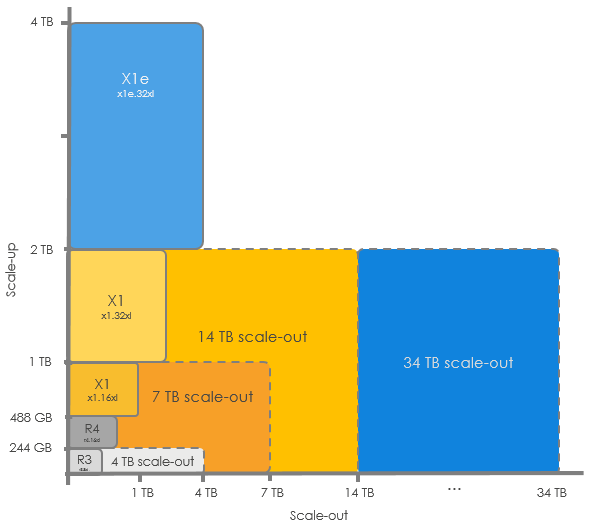

# 计算服务

## [使用 Amazon Lex 和 Amazon Alexa 创建问答自动程序](https://aws.amazon.com/cn/blogs/china/creating-a-question-and-answer-bot-with-amazon-lex-and-amazon-alexa/)

通过QnAbot应用来示例Lex和Alexa的使用。

[《使用Amazon Lex构建聊天和文本应用接口》](http://www.infoq.com/cn/news/2016/12/AWS-LEX-BOT)解释了Lex的基本功能、概念模型。Lex实现了自然语言理解与自动语音识别，Lex中的概念包括：

- 机器人（Bot）。“机器人”中包括了会话中的所有组件。
- 意图（Intent）。“意图”表示机器人用户想要达到的目标（例如购买机票、预约会面或是获取天气预报，诸如此类）。
- 表述（Utterance）。用户所说的或是所输入的一条短句就构成了一个“表述”，它会生成一个“意图”。两个简单的例子就是“我要预定酒店房间”和“我要订花”。
- 数据槽位（Slot）。为实现“意图”，用户必须提供的一部分数据，这些数据称为一个“槽位”。“槽位”是有类型的，例如一个旅行机器人中可能会具有城市、州或机场等“槽位”。
- 提示（Prompt）。“提示”是为实现“意图”而向用户请求提供数据（或是数据槽位）的问题。
- 实现（Fulfillment）。“实现”是一种业务逻辑，具体落实用户的意图。Lex支持在“实现”中使用AWS Lambda服务。

[AWS Lex介绍及入门](https://docs.aws.amazon.com/zh_cn/lex/latest/dg/what-is.html)

## [按秒计费 2017/09/21](https://aws.amazon.com/cn/blogs/china/new-per-second-billing-for-ec2-instances-and-ebs-volumes/)

总结：特定类型的EC2和EBS支持按秒计费，使用EC2/EBS的服务也能够获得按秒计费能力。

- EC2：以按需、预留和竞价形式发布的 Linux 实例的使用将按 1 秒的增量计费
- EBS：EBS 卷的预置存储也将按 1 秒的增量计费（可以理解为容量变化后即时改变计费？）
- Amazon EMR：借助适用于群集中的 EC2 实例的每秒计费功能。
- AWS Batch：AWS Batch 已启动和终止竞价型实例；利用每秒计费功能，批处理将变得更划算。

## [支持Windows的Elastic GPU 2017/09/13](https://aws.amazon.com/cn/blogs/china/new-ec2-elastic-gpus-for-windows/)

适用于 Windows 的 Amazon EC2 Elastic GPU 正式推出。
Elastic GPU 是一种 GPU 资源，可以挂载到 Amazon Elastic Compute Cloud (EC2) 实例来提升应用程序的图形性能。
Elastic GPU 提供 medium (1GB)、large (2GB)、xlarge (4GB) 和 2xlarge (8GB) 几种大小，可以作为 G3 或 G2 等 GPU 实例类型 (用于 OpenGL 3.3 应用程序) 的成本更低的替代方案。
您可以将 Elastic GPU 用于多种实例类型，灵活地为应用程序选择适当的计算、内存和存储资源，使之达到平衡。
您现在就可以在 us-east-1 和 us-east-2 区域预配置 Elastic GPU。
新服务将使运行特定图形工作负载的成本降低 80% 以上。


## [通过 IP 地址在 AWS 和本地资源间实现应用程序负载均衡](https://aws.amazon.com/cn/blogs/china/new-application-load-balancing-via-ip-address-to-aws-on-premises-resources/)

负载均衡允许针对每一个URL定制后端的IP组

1. 定义路由信息，针对URL定义后端IP组


2. 定义IP组中的IP


## [AWS SAM Local (Beta 版) – 在本地构建和测试无服务器应用程序 2017/08/21](https://aws.amazon.com/cn/blogs/china/new-aws-sam-local-beta-build-and-test-serverless-applications-locally/)

SAM Local是一款本地安装的开发工具，用于支持Serverless应用程序的开发、调试、部署。

## [AWS 纽约峰会 – 公告汇总](https://aws.amazon.com/cn/blogs/china/aws-new-york-summit-announcement-summary/)

## [AWS 合作伙伴系列网络研讨会 – 2017 年 8 月](https://aws.amazon.com/cn/blogs/china/aws-partner-series-webinar-august-2017/)

## [AWS技术峰会纽约站](https://aws.amazon.com/cn/blogs/china/aws-technology-summit-new-york-station/)

发布了7个新的服务

多个客户宣布要和AWS合作，把业务迁移到AWS

## [在 AWS Twitch 频道上推出 GameDay Essentials 节目](https://aws.amazon.com/cn/blogs/china/game-day-essentials-show-on-twitch/)

发布了一些AWS培训类的视频

## [Amazon Rekognition – 深度学习支持下的图像检测与识别服务](https://aws.amazon.com/cn/blogs/china/amazon-rekognition/)

Recognition是一个图像识别服务，根据图像内容，关联到一组标签。该博客中给出了两个例子，一个是狗的识别，一个是人脸的识别。


## [Amazon EC2 Systems Manager让你轻松管理AWS混合云](https://aws.amazon.com/cn/blogs/china/amazon-ec2-systems-manager-makes-it-easy-to-manage-aws-hybrid-cloud/)

## [你需要知道的关于高IO EC2的事儿](https://aws.amazon.com/cn/blogs/china/what-you-need-to-know-about-high-io-ec2/)

文中提到了使用高IO的VM，存储网络选择，看看是否有25Gbps网络的描述。

虚拟机的带宽限制：


## [光环新网运营的AWS中国（北京）区域HPC集群创建](https://aws.amazon.com/cn/blogs/china/fast-build-high-performance-computing-hpc-clusters-in-aws-china/)

高性能计算，看看是否跟高性能服务器有相关的内容。

## [新增 – GPU 支持的 Amazon AppStream 2.0 流式处理实例](https://aws.amazon.com/cn/blogs/china/new-gpu-powered-streaming-instances-for-amazon-appstream-2-0/)

流式处理实例是什么东西，用于什么场景，看起来像是图像识别的专用EC2示例。

## [Lambda@Edge – 在边缘智能地处理 HTTP 请求](https://aws.amazon.com/cn/blogs/china/lambdaedge-intelligent-processing-of-http-requests-at-the-edge/)

貌似是边缘计算的内容。

## [如何在Amazon EC2 Container Service上实现服务高可用的自动伸缩](https://aws.amazon.com/cn/blogs/china/how-to-implement-high-availability-automatic-scaling-of-services-on-ecs/)

## [基于Amazon EC2 Container Service构建安全高可用的Docker私有库](https://aws.amazon.com/cn/blogs/china/using-amazon-ecs-to-build-private-docker-hub/)

# [免费试用 Amazon WorkSpaces 最长达 2 个月时间](https://aws.amazon.com/cn/blogs/china/try-amazon-workspaces-at-no-charge-for-up-to-2-months/)

看起来是一个在线的工作环境。

## [EC2 内存中处理更新：具有 4 到 16 TB 内存 + SAP HANA 横向扩展到 34 TB 的实例](https://aws.amazon.com/cn/blogs/china/ec2-in-memory-processing-update-instances-with-4-to-16-tb-of-memory-scale-out-sap-hana-to-34-tb/)

AWS提供的大规格EC2实例包括什么规格，用于什么场景？AWS在提供的EC2实例规格发展趋势是什么样子，目前在做哪些事情？


我们会继续努力，让 AWS 成为运行生产 SAP 应用程序的更好平台。下面是我们正在大力改进的几个方面：

- 更大的 SAP HANA 集群 – 您现在可以使用高达 17 个节点 (34 TB 内存) 构建横向扩展 SAP HANA 集群。
- 4 TB 实例 – 即将推出的 x1e.32xlarge 实例将提供 4 TB 内存。128 个 vCPU (4 个 2.3 GHz Intel® Xeon® E7 8880 v3 处理器)
- 8 到 16 TB 实例 – 最高具有 16 TB 内存的实例正在开发中。

```
Intel® Xeon® Processor E7-8880 v3
45M Cache, 2.30 GHz

Essentials
Status: Launched
Launch Date: Q2'15
Lithography: 22 nm
Recommended Customer Price: $5895.00

Performance
# of Cores: 18
# of Threads: 36
Processor Base Frequency: 2.30 GHz
Max Turbo Frequency: 3.10 GHz
```

[Amazon EC2 X1 实例](https://aws.amazon.com/cn/ec2/instance-types/x1/)
专为云中的大规模内存中应用程序和高性能数据库而打造

X1 实例可提供高达 25Gbps 的网络带宽。此外，X1 实例还具有高达 14Gbps 的 Amazon Elastic Block Store (Amazon EBS) 专用带宽

[增强联网类型](https://docs.aws.amazon.com/zh_cn/AWSEC2/latest/WindowsGuide/enhanced-networking.html)

根据您的实例类型，可以使用以下机制之一启用增强联网：

- Intel 82599 虚拟功能 (VF) 接口
对于受支持的实例类型，Intel 82599 虚拟功能接口支持高达 10 Gbps 的网络速度。

	C3、C4、D2、I2、R3、和 M4 (m4.16xlarge 除外) 实例使用 Intel 82599 VF 接口实现增强联网。要了解哪些实例类型支持 10 Gbps 网络速度，请参阅实例类型矩阵。

- Elastic Network Adapter (ENA)
对于支持的实例类型，弹性网络适配器 (ENA) 支持高达 25 Gbps 的网络速度。

	F1、G3、I3、P2、R4、X1 和 m4.16xlarge 实例使用 Elastic Network Adapter 来实现增强联网。要了解哪些实例类型支持 25 Gbps 网络速度，请参阅实例类型矩阵。

## [敬请期待——Amazon EC2 Elastic GPU](https://aws.amazon.com/cn/blogs/china/in-the-work-amazon-ec2-elastic-gpu/)

通过OpenGL的方式进行调用，用于解决CAD工具的图形渲染问题。

## [Amazon Lightsail – 兼具 AWS 的强大功能与 VPS 的简易性](https://aws.amazon.com/cn/blogs/china/amazon-lightsail-the-power-of-aws-the-simplicity-of-a-vps/)

用于和VPS对标的服务，分配一个VM，能够选择VM所使用的OS类型及应用程序（例如LAMP等）。

参考InfoQ上的这篇文章[亚马逊推出了Lightsail虚拟专用服务器](http://www.infoq.com/cn/news/2016/12/AWS-Launch-Lightsail-VPS)

## [GPU为Amazon Graphics WorkSpaces提供助力](https://aws.amazon.com/cn/blogs/china/new-gpu-powered-amazon-graphics-workspaces/)


## [分布式神经网络框架 CaffeOnSpark在AWS上的部署过程](https://aws.amazon.com/cn/blogs/china/caffeonspark/)

# 存储

## []()
## []()

AWS存储：安全、基于S3提供HBase服务、存储能力提升（？）、存储融合方案？