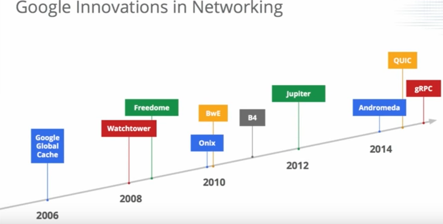

# Google数据中心网络架构

## 参考材料

1. [解密Google数据中心网络的进化](http://zeepen.com/2015/12/31/20151231-dive-into-google-data-center-networks/)
2. Jupiter论文原文[《Jupiter Rising: A Decade of Clos Topologies and Centralized Control in Google’s Datacenter Network》](http://conferences.sigcomm.org/sigcomm/2015/pdf/papers/p183.pdf)
3. B4论文原文[《B4: Experience with a Globally-Deployed Software Defined WAN》](http://cseweb.ucsd.edu/~vahdat/papers/b4-sigcomm13.pdf)
3. [Google数据中心网络技术漫谈](http://www.sdnlab.com/12700.html)
4. [走近Google基于SDN的B4网络](http://www.csdn.net/article/2013-11-25/2817613)
5. [揭秘Google数据中心网络B4](http://www.sdnlab.com/sdn-guide/14868.html)
6. [A Look Inside Google's Data Center Network](https://youtu.be/FaAZAII2x0w)，2015 Open Netwroking Summit大会Google Amin的演讲视频

## Google数据中心网络技术[（原文）](http://www.sdnlab.com/12700.html)

Google数据中心网络技术演进

Google数据中心网络技术列表

Google数据中心网络的设计与实现引入了以下三条策略：

- 基于Clos网络。Clos网络来自传统的电路交换领域，它于上世纪五十年代就被提出。其核心理念是无阻塞的多级交换技术，其中每一级的每个单元与下一级的设备都是全相连，其最大的优势在于能够提供海量的东西向流量传输支持。
- 使用商用晶片（Merchant Silicon）。商用晶片的优势之一是降低成本，避免了传统网络设备采用厂商定制ASIC带来的的高昂成本；同时，Google在运用商用晶片时还有额外的要求，最典型是要其支持Google对网络协议的自主创新。
- 建立统一控制。逻辑上集中的控制是SDN的核心理念，通过拥有全局网络视图的控制器统一控制网络传输通路，使得全网数以千计的网络转发设备能够像一台能力强大的网络设备一样工作，提升资源利用率，降低管理复杂度。

# 广域网技术B4[(原文)](http://www.sdnlab.com/sdn-guide/14868.html)

解决的场景：数据中心之间突发流量是平均流量的2～4倍，如果按照峰值流量配置网络带宽，则广域网的成本会非常高昂。如果尽量把带宽给跑满，用最少的带宽来支持业务的发展。

解决的思路：把数据中心之间的数据包区分不同的优先级，动态调整不同优先级的网络流量。

Google 观察到，数据中心中的流量是有不同优先级的：

- 用户数据拷贝 到远程数据中心，以保证数据可用性和持久性。这个数据量最小，对延迟最敏感，优先级最高。
- 远程存储访问 进行 MapReduce 之类的分布式计算。
- 大规模数据同步 以同步多个数据中心之间的状态。这个流量最大，对延迟不敏感，优先级最低。

# 数据中心网络技术Jupiter

- 第一，利用多级互连的Clos拓扑网络技术，使得Google可以通过商业交换芯片来搭建大规模的交换网络系统。
- 第二，传统网络中大量通用的，分布式的，非常复杂的网络路由和管理协议虽然可以支持任意的部署方式，但是这对于需要单一操作平面的数据中心网络却矫枉过正了。Google建立了中心化控制的，支持全局配置的数据中心网络。
- 第三，模块化的硬件设计加上简单的、高可靠性的软件使得Google可以设计出同时支持数据中心内部集群间路由和外部广域网路由的系统。