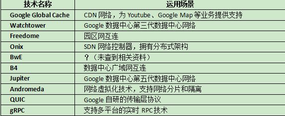

# Google数据中心网络架构

## 参考材料

1. [解密Google数据中心网络的进化](http://zeepen.com/2015/12/31/20151231-dive-into-google-data-center-networks/)
2. 论文原文[《Jupiter Rising: A Decade of Clos Topologies and Centralized Control in Google’s Datacenter Network》](http://conferences.sigcomm.org/sigcomm/2015/pdf/papers/p183.pdf)
3. [Google数据中心网络技术漫谈](http://www.sdnlab.com/12700.html)
4. [走近Google基于SDN的B4网络](http://www.csdn.net/article/2013-11-25/2817613)
5. [揭秘Google数据中心网络B4](http://www.sdnlab.com/sdn-guide/14868.html)

## Google数据中心网络技术列表

# 广域网技术B4

解决的场景：数据中心之间突发流量是平均流量的2～4倍，如果按照峰值流量配置网络带宽，则广域网的成本会非常高昂。如果尽量把带宽给跑满，用最少的带宽来支持业务的发展。

解决的思路：把数据中心之间的数据包区分不同的优先级，动态调整不同优先级的网络流量。

Google 观察到，数据中心中的流量是有不同优先级的：

- 用户数据拷贝 到远程数据中心，以保证数据可用性和持久性。这个数据量最小，对延迟最敏感，优先级最高。
- 远程存储访问 进行 MapReduce 之类的分布式计算。
- 大规模数据同步 以同步多个数据中心之间的状态。这个流量最大，对延迟不敏感，优先级最低。

# 数据中心网络技术Jupiter

- 第一，利用多级互连的Clos拓扑网络技术，使得Google可以通过商业交换芯片来搭建大规模的交换网络系统。
- 第二，传统网络中大量通用的，分布式的，非常复杂的网络路由和管理协议虽然可以支持任意的部署方式，但是这对于需要单一操作平面的数据中心网络却矫枉过正了。Google建立了中心化控制的，支持全局配置的数据中心网络。
- 第三，模块化的硬件设计加上简单的、高可靠性的软件使得Google可以设计出同时支持数据中心内部集群间路由和外部广域网路由的系统。