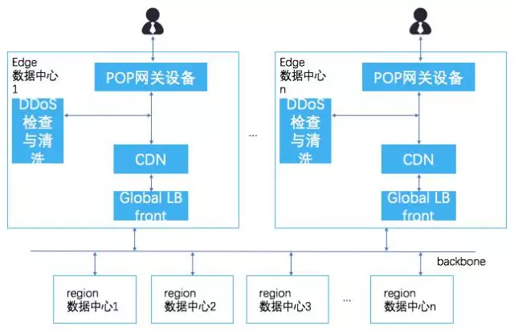
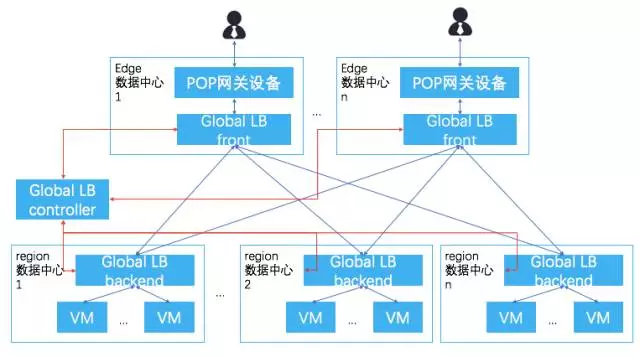

```
本篇定位为一个学习笔记
化云为雨是一个个人微信公众号，里面有不少其个人分析云计算业界信息的文章，内容覆盖计算、网络、存储、AWS、GCP领域，具有一定深度
```

# [数据中心发展趋势猜想](https://mp.weixin.qq.com/s?__biz=MzA5OTQ5NDg1NA==&mid=2651219872&idx=1&sn=a7ba0bca0fc7572eba2548b118f3fc87&chksm=8b73b909bc04301f97d32bb24189c615452e256598bb47f09a6111e1ffef84248f2a17bd8333&mpshare=1&scene=1&srcid=1012eVtoEMOL9E6lb8OOE4Yk&pass_ticket=ieyCJIv0frKh7XNYdZ7xHeJd5MOKuoItoBhckeiIZg4NsRaDcG5YDikPXFrjBUXs#rd)

观点：
1. 大型数据中心数量增长，小型数据中心数量下降，整体数据中心数量下降。
2. 大型数据中心分据国内南北两侧，小型edge数据中心位于国内中部。中部的edge数据中心通过ISP原有网络提供接入客户请求，通过新的DCI专线网络，将请求转发到位于南北的大型数据中心。
3. 网络架构演进到GCP的大edge数据中心架构。用户通过GLB接入边缘数据中心，边缘数据中心再通过GLB接入大型数据中心。
    - 边缘数据中心：DDoS检测，CDN加速，边缘计算加速等
    - 大型数据中心



参考：中国数据中心工作组成员撰写的《数据中心现状与发展趋势》

术语：
- DCI：Data Center Interconnect
- GCP：Google Cloud Platform

疑问：
1. Google数据中心网络架构是什么样子的
2. 作者是参考什么材料的

# [从AWS VPC看数据中心网络（一）](https://mp.weixin.qq.com/s?__biz=MzA5OTQ5NDg1NA==&mid=402666073&idx=1&sn=cefbe2476dad216738a5776ffc085bb5&mpshare=1&scene=1&srcid=1012y8eVCcbEYIeD5eSuVHIi&pass_ticket=ieyCJIv0frKh7XNYdZ7xHeJd5MOKuoItoBhckeiIZg4NsRaDcG5YDikPXFrjBUXs#rd)

观点：

1. 物理网络：
    1. AWS目前有12个region，32个AZ，AZ内有1~6个不等的数据中心。各个region间、同reigonAZ间，同AZ的数据中心间有专线互联。
    2. 1个region内选取2个AZ作为transmit出口，其它AZ网状互联，保证2ms的时延与最大25T峰值的带宽。
    3. AZ内1~6个DC，DC之间时延小于0.25ms。
    4. 综上所述，AZ间通常为50公里，AZ内数据中心通常为30公里内，一般为同城。
    5. 结合流量图看，region间的transmit AZ为环型骨干网，region内的AZ内网状互联，AZ内的DC互联没有明确表述，推论为网状互联。

2. 租户网络：
    1. 每个数据中心有5w~8w台服务器
    2. 从业务对DC的网络要求来看， AWS的VPC在09年实现为VLAN。2011年实现了目前的NAT方式的VPC，并将其扩展到多AZ。
    3. AWS的Xen的网络协议栈有很大的定制，推理已经迁移到VMM，并在此完成了private IP的NAT，ARP的代答，类似于openstack基于OVS的DVR。
    4. 从网络技术上面看， TRILL等大二层的4k规模远远达不到其上万台数据中心的规模。 同时AWS 1v1实例的内网带宽都为10G，表面其网络为点点10G。综合起来，AWS的VPC为L3 clos组网 + 类似vxlan。
    5. 看基于overlay的VPC上线时间，AWS不太可能使用标准的vxlan, 所以不太可能有厂商有支持其私有协议的设备 。同时从AWS的VPC endpoint只支持S3， 以及通过1V1的虚拟机替代物理机的思路来看， 其网络还是应该延生的主机上。
 
# [GCP global LB、抗D和边缘计算](https://mp.weixin.qq.com/s?__biz=MzA5OTQ5NDg1NA==&mid=2651219861&idx=1&sn=d2b8ff87fb123a96d8d24efc65e181c8&chksm=8b73b93cbc04302af525b5470d2a84b795d9223384c43635de8f14714dce297a9ea8913ef95e&mpshare=1&scene=1&srcid=1012kQJe4zbcC510gRLvot8p&pass_ticket=ieyCJIv0frKh7XNYdZ7xHeJd5MOKuoItoBhckeiIZg4NsRaDcG5YDikPXFrjBUXs#rd)

观点：
1. GCP的Global LB实现分为两层，GLB Front（部署于边缘数据中心）和GLB Backend（部署于区域数据中心）。GLB Front用于做DDoS流量清洗和CDN。

    

    

2. CDN的发展分为三个阶段：
    - 静态加速是传统业务模式，最终客户对edge发起请求时，如果已经缓存该资源则直接返回，如果没有则从源拉取该资源后返回。当然也有预发布等服务，不在此赘述。
    - 动态加速是当前的业务模式，最终客户对edge发起的请求有js等非静态内容时，edge会所为一个代理，将请求转发到源的服务，并将结果传递给最终客户。动态加速结合静态加速，其实已经实现可全站的加速，最终客户只需要看到CDN提供的IP即可享受全部的服务，而不需要看到最终的源站IP。比如cloudfare，通过全站加速已经可以帮助客户实现廉价的抗D方案。
    - 边缘计算是新起的服务，对于一些不需要与源数据库发生交互，在edge内可以完成的动态内容，租户可以通过UDF（User Defined Function）的方式提供函数包。当最终客户在edge请求时，edge从源拉取该函数包并在本地执行，给最终客户更好的用户体验。 

# [从GCP分级网络看公有云网络发展趋势](https://mp.weixin.qq.com/s?__biz=MzA5OTQ5NDg1NA==&mid=2651219785&idx=1&sn=5a0efbf12deb73473a21879eb5518e00&chksm=8b73b9e0bc0430f6a57789a47702467efae4edae4e289a8e0e267cf082b69365539587c20fb3&mpshare=1&scene=1&srcid=1012SGy9yPKdirZCkcnsMXPc&pass_ticket=OLbVc7rJgVSay2JYwL5UiGnVA88ohqWSwinYxMMprqj7O1U68UuomwAVTD4Wc2Sn#rd)

观点：
1. Google提供了普通网络和高级网络
    1. 普通网络，在数据包回包时，直接从VM所在的region就进入internet
    2. 高级网络，在数据包回包时，从VM所在的region通过GCP的内部网络先走到离用户最近的pop点，再进入internet
2. 可以通过SD-WAN实现，是个SD-WAN研究的好的场景

# [看AWS新一代Load Balance](https://mp.weixin.qq.com/s?__biz=MzA5OTQ5NDg1NA==&mid=2651219827&idx=1&sn=cb24bd0ac2cc9deed467e1d5c998a370&chksm=8b73b9dabc0430cc993358b27b37490171e45fb04f8f64389e3f77163940f48662c3f7408dc3&mpshare=1&scene=1&srcid=1012ZlfGCCGTJfMrGX1zYf2Z&pass_ticket=6MAIZzajMujHVvS9g222BjTUqRvYTG0YTapfaGbeX%2FESRERQJewM51RZI3%2BpxZOK##)


# []()
# []()
# []()
# []()
# []()
# []()
# []()
# []()
# []()
# []()
# []()
