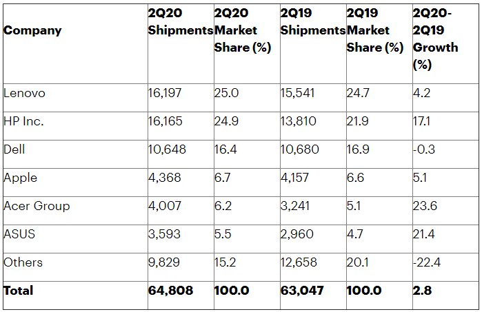
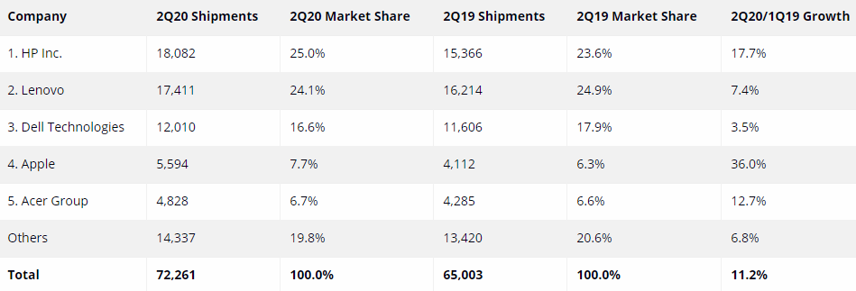
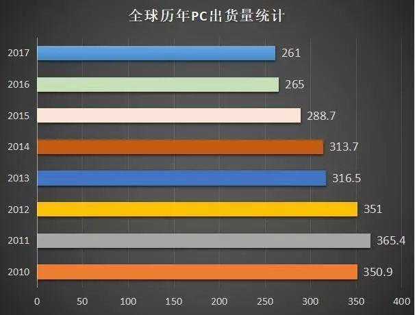
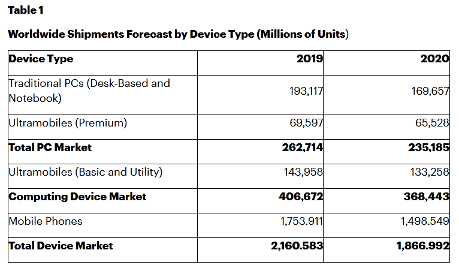

# 电子产品出货量

## 手机出货量

## PC出货量

据国际数据公司（IDC）发布的最新数据，2020年第四季度全球PC出货量同比增长26.1%，达到9160万台。**2020年全年，全球PC市场出货量同比增长13.1%，达到3.03亿台**。

前五大PC厂商分别为联想、惠普、戴尔、苹果和宏碁。2020年，联想PC出货量为7266.9万台，同比增长12%，市场份额为24%，排名第一；惠普出货量为6764.6万台，同比增长7.5%，市场份额为22.4%；戴尔出货量为5029.8万台，同比增长8.1%，市场份额为16.6%；苹果出货量为2310.2万台，同比增长29.1%；市场份额为7.6%；宏碁出货量为2098.9万台，同比增长22.9%，市场份额为6.9%。
2020 Q2：约7000万台，全年预计2.8亿台

Gartner统计出货6480万台

IDC统计出货7226万台

2010~2017年出货量统计

全球PC手机出货占比

参考：

- [Gartner、IDC：2020年Q2全球PC出货量反弹，但可能不会持续](https://www.zhitongcaijing.com/content/detail/317123.html)
- [2020年全球PC市场出货量同比增长13.1%，满血复活](https://m.ebrun.com/ebonno/co_44749.html)
- [Gartner：2020年全球设备出货量总计19亿台 同比下降14%](https://tech.sina.com.cn/roll/2020-06-09/doc-iirczymk5968722.shtml)
- [华为智慧商用台式机，开辟后PC时代的“创新”](https://news.tom.com/202012/4664027787.html)

## 服务器出货量

36氪获悉，日前，Gartner发布2020年第一季度全球通用服务器市场数据，全球通用服务器出货量286万台，同比上升1.0%，厂商销售额160.8亿美元，同比下降0.1%。市场表现上，第一季度全球服务器市场厂商销售额前三名依次是戴尔、HPE、浪潮。

参考：

- [Gartner：2020年Q1全球通用服务器出货量同比上升1.0%，浪潮位居全球第三](https://36kr.com/newsflashes/753691579061767)

## 消费者BG

- 1+8+N：1+8+N是硬件平台，手机+（平板、PC、穿戴、智慧屏、AI音箱、耳机、VR、车机）+生态伙伴硬件（IOT）；两个+是软件平台（HuaweiShare+HiLink，应用联通，硬件的互联互通以及能力共享）；5G+AI的内涵是什么；全场景智慧生活
- 鸿蒙OS：21年发布基于鸿蒙的智能手机
- HMS Core

AI音箱：语音控制，控制家电设备，联网海量资源（教育、音乐等）

朱平强调，华为终端目前是“1+8+N”的战略，1就是手机是主入口，8就是4个大屏的入口：PC、平板、智慧大屏、车机，而非大屏入口现在发布的有耳机、音箱、手表，眼镜。N则是泛IoT硬件构成的华为HiLink生态。这其中的1+8是华为自己在做，而这个N则欢迎更多的合作伙伴加入，最终形成一个更为开放的形态。

参考：

- [专访华为朱平：华为的1+8+N战略，如何将全场景智慧生活落地 ](https://www.sohu.com/a/308523129_118797)
