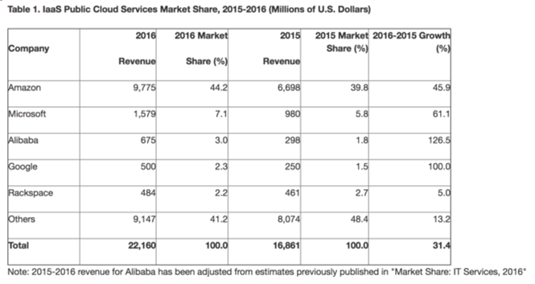

9月28日，美国知名财经媒体《财富》引述Gartner最新发布的全球云计算市场份额报告称，过去一年全球云计算三大巨头中，增长最快的不是亚马逊和微软，而是来自中国的阿里云。Gartner称，全球3A阵营引领市场，其中阿里云规模增长最快，在中国市场具有统治地位，并积极拓展国际市场。
　　
文章引述Gartner报告称，2016年阿里云IaaS营收达到了6.75亿美元，增速达到了126%。全球云计算“3A”(亚马逊AWS、微软Azure和阿里云Alibaba Cloud)引领公共云市场，三者占据市场份额前三位，亚马逊保持领先优势，中国云计算领头羊阿里云超越Google，紧追第二位微软Azure。

知名行业媒体computerweekly也为阿里云点赞。文章称，阿里云出色的营收增长已经超过了亚马逊、微软和谷歌。“虽然亚马逊依旧是公有云市场的领导者，但Gartner数据显示阿里云给其他竞争者带来了压力。”
　　
“3A”阵营中，AWS市场份额最大，但阿里云的收获最大。3A不仅仅占据了过半市场份额，而且增速也跑赢大盘，阿里云增速拔得头筹，达到126%。同期亚马逊AWS增速为45.9%，微软为61%。凭借着强劲的增长，阿里云连续两年力压谷歌，排名第三;谷歌则位居第四。

Gartner认为，亚马逊、微软和阿里云三大巨头引领了增长，预估IaaS、PaaS和SaaS的5年增长分别为28%、22%和19%。领先的云服务商将继续保持市场份额，并在未来四年占据近四分三的市场份额。未来新的技术和服务也将诞生在这些市场领先的云平台上。

Gartner观点也得到了行业人士的认同。geekwire文章引述摩根士丹利分析师Brian Nowak观点称，公有云的强劲增长将持续到2021年，越来越多的企业会考虑3A的产品和服务。这意味着3A还有强大的增长潜力。

