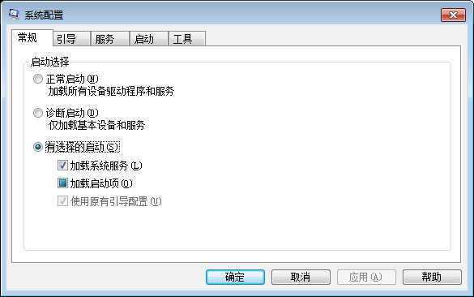
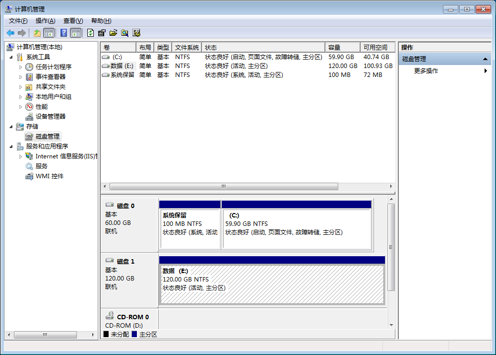

# Windows使用

## 配置启动项

运行"msconfig"，在“启动”页配置系统启动项。



## 查看系统启动的端口及对应进程

1. 查看系统启动的端口：运行命令“netstat -ano”

    ```
    C:\>netstat help
    
    显示协议统计和当前 TCP/IP 网络连接。
    ...
      -a            显示所有连接和侦听端口。
      -n            以数字形式显示地址和端口号。
      -o            显示拥有的与每个连接关联的进程 ID。
    ```
    
    ```
    C:\>netstat -ano
    
    活动连接
    
      协议  本地地址          外部地址        状态           PID
      TCP    0.0.0.0:135            0.0.0.0:0              LISTENING       908
      TCP    0.0.0.0:445            0.0.0.0:0              LISTENING       4
      TCP    0.0.0.0:1494           0.0.0.0:0              LISTENING       2176
      TCP    0.0.0.0:2598           0.0.0.0:0              LISTENING       2176
      TCP    0.0.0.0:3389           0.0.0.0:0              LISTENING       1168
      TCP    0.0.0.0:5985           0.0.0.0:0              LISTENING       4
      TCP    0.0.0.0:8081           0.0.0.0:0              LISTENING       1848
      TCP    0.0.0.0:19080          0.0.0.0:0              LISTENING       4
      TCP    0.0.0.0:47001          0.0.0.0:0              LISTENING       4
      TCP    0.0.0.0:49152          0.0.0.0:0              LISTENING       584
      TCP    0.0.0.0:49153          0.0.0.0:0              LISTENING       984
      TCP    0.0.0.0:49154          0.0.0.0:0              LISTENING       476
      TCP    0.0.0.0:49361          0.0.0.0:0              LISTENING       708
      TCP    0.0.0.0:49384          0.0.0.0:0              LISTENING       692
      TCP    0.0.0.0:51139          0.0.0.0:0              LISTENING       4436
      TCP    10.229.34.174:139      0.0.0.0:0              LISTENING       4
    ```

    最后一列就是使用该端口的进程PID

2. 根据PID查询对应进程名字：运行命令“tasklist | findstr <PID>”

    ```
    C:\>tasklist | findstr 584
    wininit.exe                    584 Services                   0        308 K
    ```

## windos7格式化硬盘

使用Widnows自带的磁盘管理管理工具。“我的电脑” 右键 “管理”：



## 小红伞

> 原则上来讲，小红伞，就是avira
>
> 或许你指的是独立的avira小红伞杀软，当然，轮杀毒能力应该是小红伞比360强一些。
> 但是诺顿，卡巴斯基，eset比小红伞还要好上一些。
> 也就是说不考虑实际使用情况（钟国互联网情况）的话，你装我上面说的那三个家伙，防护能力理论上来说会更强一些。
> 但我选择使用Windows defender     Windows firewall和UAC

    作者：刘大铁棍
    链接：https://www.zhihu.com/question/27165468/answer/128345979
    来源：知乎
    著作权归作者所有。商业转载请联系作者获得授权，非商业转载请注明出处。

## FreeSSHd 

FreeSSHd是windows上的一款ssh服务器。

FreeSSHd在Windows上安装之后，需要以管理员身份运行，否则无法修改配置文件，就无法配置用户，会导致无法使用。

## PC问题处理

chrome浏览器所有页面都崩溃，把百度相关软件卸载后，删除windows驱动目录下bd0001.sys后，重启Windows恢复
C盘空间太小，使用windirstat程序统计后，发现是系统虚拟内存分页、休眠文件太大所致，把系统休眠禁止掉、虚拟内存分页移动到其他硬盘分区后恢复；三板斧：取消休眠、虚拟内存配置到其他硬盘、磁盘清理
IE/Chrome/Firefox都可以安装AdblockPlus插件

Windows SSH Server：使用FreeSSHd软件，可以在windows上启动SSD Server，可以提供SSH、SFTP能力。使用Putty、WinSCP可以连接。在手机上使用JuiceSSH、AndFTP也可以连接。SSH服务存在中文字符显示问题。
